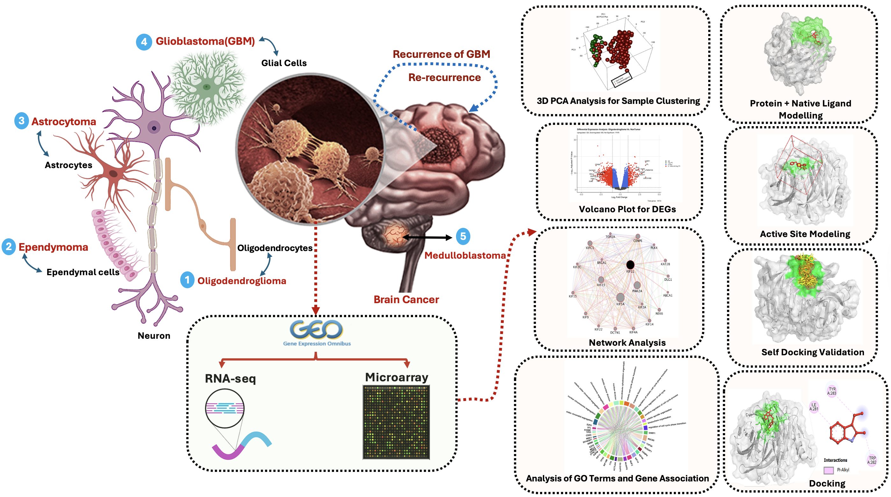

# Therapeutic Biomarker Discovery in Brain Cancer through Integrative Transcriptome Analysis and Molecular Docking Simulations

## Authors
Mohamed Hesham, Mohamed Hamed, Sameh S. Ali, Fadhl M. Alakwaa, Asmaa Reda\*

\*Corresponding author

## Published Paper
[Read the article here](#)  

## About This Repository

Brain and central nervous system (CNS) cancers, such as glioblastoma, oligodendroglioma, ependymoma, astrocytoma, and medulloblastoma, pose persistent clinical challenges due to their high molecular heterogeneity and resistance to therapy. This study integrates RNA-seq and microarray datasets to identify common differentially expressed genes (DEGs) across five brain cancer types. We identified 84 common DEGs, with 56 consistently upregulated.

Functional enrichment analysis revealed significant involvement of these genes in mitotic processes, including chromosome segregation and spindle formation. Network analysis highlighted ten hub genes (EZH2, KIF11, KIF14, KIF20A, KIF2C, KIF4A, NDC80, NUF2, TPX2, and TTK), which were deeply involved in cell cycle regulation and tumor progression. These hub genes were also linked to immune cell infiltration within the tumor microenvironment.

Motif analysis identified conserved transcription factor binding sites, indicating shared regulatory mechanisms. We further explored the therapeutic potential of these targets through molecular docking simulations using 21 blood-brain barrier-permeable inhibitors. Among these, Olaparib and Cabozantinib demonstrated strong and consistent binding to multiple hub proteins, notably TTK, KIF20A, and KIF2C. These results support their use as multitarget inhibitors and underscore their potential in treating brain and CNS malignancies.

## License

This repository is licensed under the MIT License. See the `LICENSE` file for details.

## Contact

For questions or collaboration inquiries, please contact:  
**Dr. Asmaa Reda** – areda@zewailcity.edu.eg
